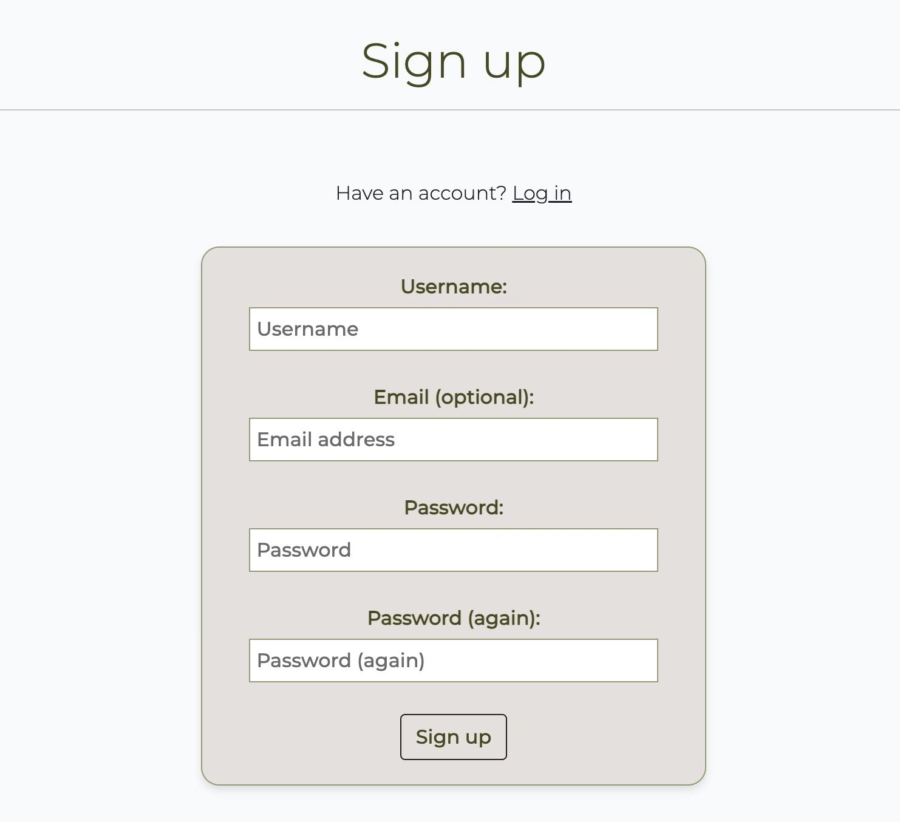

# Letters from Zaragoza

Letters from Zaragoza is a restaurant guide app for Zaragoza (a city in the north-east of Spain). The app is targeted towards users who enjoy their food and want to learn more about the best restaurants in Zaragoza!

The site displays a blog of the best restaurants by category in the city (e.g. best pizza, best hamburger, best fine dining etc).

The live link can be found here - [Letters from Zaragoza](https://letters-from-zaragoza-663ab0086474.herokuapp.com/).

### User Stories

#### EPIC | User Profile
- As a Site User I can register an account so that I can comment on posts.
- As a Site User I can login/logout of my account so that I can keep my account secure.
- As a Site User I can view my login status so that I know whether I am logged in or not.

#### EPIC | User Navigation
- As a Site User I can access the homepage and immediately understand the purpose of the site.
- As a Site User I can easily navigate the site so that I do not get easily lost and I know where I am.
- As a Site User I can view a list of the best restaurants by category so that I can select a review to read.
- As a Site User I can click on a review on the restaurants page so that I can know more about the restaurant.  

#### EPIC | Review Interaction
- As a Site User I can comment on a restaurant review so that I can give my feedback.
- As a Site User I can edit and delete comments so that I can easily make changes if I made a mistake. 
- As a Site Admin I can review or disapprove comments so that only appropriate comments are displayed on the site.

#### EPIC | Review Management
- As a Site Admin I can create, read, update and delete reviews so that I can manage my content.
- As Site Admin I can mark my reviews as 'save for later' or 'publish now' depending on whether they are finished or not.

#### EPIC | About Letters from Zaragoza
- As a site user I can click on the About link so that I can read about the site.
- As a Site Admin I can create or update the about page content so that it is available on the site.

#### EPIC | Contact
- As a site user I can contact the site owner via the contact form so that I can make suggestions/propose collaboration opportunities.
- As a site owner I can monitor contact requests via a database so that I can keep track of contact requests.
- As a site owner I can mark each contact request as read once complete so that I can keep track of my progress.

#### EPIC | Celebrate Restaurant Reviews
- As a Site User I can like or unlike a restaurant review so that I can interact with posts
- As a Site User I can add/remove restaurants from my favourites so that I can be reminded which restaurants I like

### Design
When picking the colours for the website I researched a number of food blogs. I noticed that on the majority of these websites minimal colour was used. This allows the images of the food to really shine.  

#### Colour Scheme
Colour palette from Coolors


The colours I chose are quite neutral. I have predominently kept the backgrounds white or close to white and then I picked variations on greens and beiges.

Great care was taken to establish a good contrast between background colours and text at all times to ensure maximum user accessibility. 

#### Fonts
The Montserrat font is the main font used for the body of the website with the Playfair Display font used for the main headings on the home page. These fonts were imported via Google Fonts. Sans Serif is the backup font, in case for any reason the main font isn't being imported into the site correctly.

#### Wireframes

<details>

 <summary>Landing Page</summary>


</details>

<details>

<summary>Restaurants</summary>


</details>


<details>

<summary>Restaurant Detail</summary>


</details>

<details>

<summary>Login</summary>


</details>

<details>

<summary>Contact</summary>


</details>

## Agile Methodology

Github projects was used to manage the development process using an agile approach. Please see link to project board [here](https://github.com/users/cgrace0044/projects/5/views/1)

The project board is very effective as it allows the project manager to move issues between 'To Do', 'In Progress' and 'Done':


The below epics (as detailed above) were documented in Github projects as milestones:
- User Profile
- User Navigation
- Review Interaction
- Review Management
- About Letters from Zaragoza
- Contact
- Celebrate Reviews

Each epic has a number of user stories which are broken down into acceptance criteria and further broken down as tasks. Once tasks were complete they were marked as done within the checklist. Issues were moved to 'Done' within the project board once complete. 

## Data Model
Please see the database schema created for the project below: 


## Testing

Testing and results can be found [here](/testing.md)

## Features

### Header

### Footer

- The footer contains a span stating 'Follow Our tasty Zaragoza journey'.
- Links to Twitter, Instagram, Facebook and Youtube are also included.
- Clicking the links in the footer opens separate tabs.

### Home Page

### User Account Pages

**Sign Up**



**Log In**


**Log Out**


- Django allauth was installed and used to create the Register, Log in and Log out functionality. 

## Deployment to Heroku

To deploy your Django app to Heroku, follow the steps below:

---

### 1. Prepare the Application

- Update `requirements.txt` by running:  
  ```bash
  pip3 freeze > requirements.txt
  ```
  Heroku uses this file to install dependencies.

- Ensure your project is production-ready:
  - Secret keys and sensitive variables are stored in `env.py`.
  - Static and media file settings are configured properly.
  - Your `settings.py` is updated for production (see below).

### 2. Create a Heroku App

1. Log in or sign up at [Heroku](https://heroku.com).
2. From the Heroku Dashboard, click **"Create New App"**.
3. Choose a unique app name and select your region.
4. Click **"Create App"** to proceed.

### 3. Attach a Postgres Database

1. In the app dashboard, go to the **"Settings"** tab.
2. Scroll to **"Config Vars"** and click **"Reveal Config Vars"**.
3. Add a new key-value pair:
   - **Key:** `DATABASE_URL`
   - **Value:** Your Postgres database URL.

### 4. Configure Environment and `settings.py`

- Create an `env.py` file in your project root:
  ```python
  import os

  os.environ['SECRET_KEY'] = 'your-secret-key'
  os.environ['DATABASE_URL'] = 'your-database-url'
  os.environ['CLOUDINARY_URL'] = 'your-cloudinary-url'
  ```
- In `settings.py`:
  - Import `env.py`.
  - Replace default `DATABASES` config with the one sourced from `DATABASE_URL`.
  - Set `SECRET_KEY = os.environ.get('SECRET_KEY')`.
  - Add Cloudinary settings for media file handling.
  - Configure static files:
    ```python
    STATIC_URL = '/static/'
    STATIC_ROOT = os.path.join(BASE_DIR, 'staticfiles')
    STATICFILES_STORAGE = 'cloudinary_storage.storage.StaticHashedCloudinaryStorage'

    MEDIA_URL = '/media/'
    DEFAULT_FILE_STORAGE = 'cloudinary_storage.storage.MediaCloudinaryStorage'
    ```
  - Update templates path if necessary:
    ```python
    TEMPLATES_DIR = os.path.join(BASE_DIR, 'templates')
    ```
  - Add your Heroku app to `ALLOWED_HOSTS`:
    ```python
    ALLOWED_HOSTS = ['your-app-name.herokuapp.com', 'localhost']
    ```

### 5. Create a `Procfile`

- In the project root, create a file named `Procfile` (no extension) with:
  ```
  web: gunicorn project_name.wsgi
  ```

---

### 6. Set Config Vars on Heroku

In the **Config Vars** section of your Heroku app, add:

- `SECRET_KEY`
- `CLOUDINARY_URL`
- `PORT` = `8000`

### 7. Add Buildpacks

1. Go to the **Settings** tab.
2. Under **Buildpacks**, add the following (in order):
   - Python
   - Node.js

### 8. Connect to GitHub & Deploy

1. Go to the **Deploy** tab.
2. Select **GitHub** as your deployment method.
3. Search for your repository and click **Connect**.
4. Choose your deployment method:
   - **Enable Automatic Deploys** *(recommended)*, or
   - **Manual Deploy** from the `main` branch.
5. Click **Deploy Branch** to start deployment.
6. Once deployment completes, click **"View"** to access your live site.

### Your Site is Now Live!

Your Django app is now deployed and operational on Heroku.

## Forking this repository
- Locate the repository at this link [Letters from Zaragoza](https://github.com/cgrace0044/pp4_zaragoza_restaurants).
- The fork button is located on the right side of the repository menu 
- To copy the repository to your Github account, click the button

## Cloning this repository
To clone this repository follow the below steps: 

1. Locate the repository at this link [Letters from Zaragoza](https://github.com/cgrace0044/pp4_zaragoza_restaurants). 
2. Navigate to the main page of the repository and click **Code**.
3. Open **Terminal**.
4. In Terminal, change the current working directory to the desired location of the cloned directory.
5. Type **'git clone'**, and then paste the URL copied from GitHub earlier. 
6. Type **'Enter'** to create the local clone. 

Any changes required to the website, they can be made, committed and pushed to Github.

## Languages

- [Python](https://www.python.org/) 
- [Markdown](https://en.wikipedia.org/wiki/Markdown)
- [HTML](https://developer.mozilla.org/en-US/docs/Glossary/HTML5 "HTML")
- [CSS](https://developer.mozilla.org/en-US/docs/Web/CSS "CSS")
- [JS](https://developer.mozilla.org/en-US/docs/Web/JavaScript "JS")

## Frameworks - Libraries - Programs Used
- [Django](https://www.djangoproject.com/): Main python framework used in the development of this project
- [Django-allauth](https://django-allauth.readthedocs.io/en/latest/installation.html): authentication library used to create the user accounts
- [PostgreSQL](https://www.postgresql.org/) was used as the database for this project.
- [Heroku](https://dashboard.heroku.com/login) - was used as the cloud based platform to deploy the site on.
- [Responsinator](http://www.responsinator.com/) - Used to verify responsiveness of website on different devices.
- [Balsamiq](https://balsamiq.com/) - Used to generate Wireframe images.
- [Chrome Dev Tools](https://developer.chrome.com/docs/devtools/) - Used for overall development and tweaking, including testing responsiveness and performance.
- [Font Awesome](https://fontawesome.com/) - Used for icons in information bar.
- [GitHub](https://github.com/) - Used for version control and agile tool.
- [Google Fonts](https://fonts.google.com/) - Used to import and alter fonts on the page.
- [W3C](https://www.w3.org/) - Used for HTML & CSS Validation.
- [PEP8 Online](http://pep8online.com/) - used to validate all the Python code
- [Jshint](https://jshint.com/) - used to validate javascript
- [Coolors](https://coolors.co/) - Used to create colour palette.
- [Favicon](https://favicon.io/) - Used to create the favicon.
- [Lucidchart](https://lucid.app/documents#/dashboard) - used to create the database schema design
- [Summernote](https://summernote.org/): A WYSIWYG editor to allow users to edit their posts
- [Cloudinary](https://cloudinary.com/): the image hosting service used to upload images
- [Bootstrap 5](https://getbootstrap.com/docs/5.0/getting-started/introduction/): CSS Framework for developing responsiveness and styling
- [Crispy Forms](https://django-crispy-forms.readthedocs.io/en/latest/): Used to manage Django forms, making form rendering in templates simpler and more elegant.