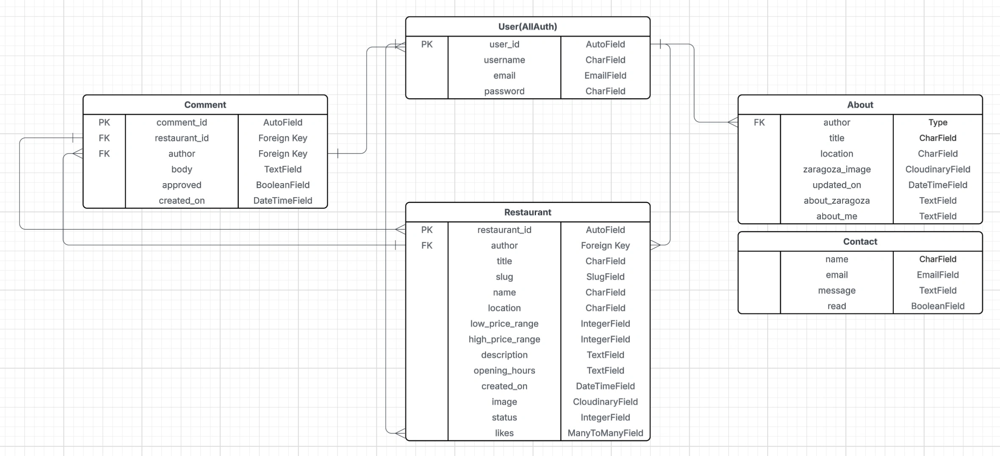

# Letters from Zaragoza

Letters from Zaragoza is a restaurant guide app for Zaragoza (a city in the north-east of Spain). The app is targeted towards users who enjoy their food and want to learn more about the best restaurants in Zaragoza!

The site displays a blog of the best restaurants by category in the city (e.g. best pizza, best hamburger, best fine dining etc).

The live link can be found here - [Letters from Zaragoza](https://letters-from-zaragoza-663ab0086474.herokuapp.com/).

### User Stories

#### EPIC | User Profile
- As a Site User I can register an account so that I can comment on posts.
- As a Site User I can login/logout of my account so that I can keep my account secure.
- As a Site User I can view my login status so that I know whether I am logged in or not.

#### EPIC | User Navigation
- As a Site User I can access the homepage and immediately understand the purpose of the site.
- As a Site User I can easily navigate the site so that I do not get easily lost and I know where I am.
- As a Site User I can view a list of the best restaurants by category so that I can select a review to read.
- As a Site User I can click on a review on the restaurants page so that I can know more about the restaurant.  

#### EPIC | Review Interaction
- As a Site User I can comment on a restaurant review so that I can give my feedback.
- As a Site User I can edit and delete comments so that I can easily make changes if I made a mistake. 
- As a Site Admin I can review or disapprove comments so that only appropriate comments are displayed on the site.

#### EPIC | Review Management
- As a Site Admin I can create, read, update and delete reviews so that I can manage my content.
- As Site Admin I can mark my reviews as 'save for later' or 'publish now' depending on whether they are finished or not.

#### EPIC | About Letters from Zaragoza
- As a site user I can click on the About link so that I can read about the site.
- As a Site Admin I can create or update the about page content so that it is available on the site.

#### EPIC | Contact
- As a site user I can contact the site owner via the contact form so that I can make suggestions/propose collaboration opportunities.
- As a site owner I can monitor contact requests via a database so that I can keep track of contact requests.
- As a site owner I can mark each contact request as read once complete so that I can keep track of my progress.

#### Wireframes

 
Landing Page

Restaurants

Restaurant Detail

Login

Contact

## Data Model
Please see the database schema created for the project below: 

## Deployment
In order to deploy the app to Heroku the following steps were followed:
### Create the Heroku App:
- Update requirements.txt file within your IDE using command pip3 freeze > requirements.txt
- Heroku will use the above list to install these packages into your application before the project is run.
- Sign into Heroku or create an account if you don't yet have one.
- From the Heroku dashboard click 'Create New App'.
- Name the App and select your region. The App name will need to be something unique.
- Now select 'Create App'

### Attach the Postgres database:
- Click on the settings tab within your App and scroll to Config Vars.
- Click Reveal Config Vars.
- As a key type DATABASE_URL and the corresponding value should be your postgres database. 

### Prepare the environment and settings.py file:
- In VS Code ensure you have an env.py file created in your route directory.
- Both your database value and your secret key should be located in your env.py file.
- Update the settings.py file to import the env.py file and add the SECRETKEY and DATABASE_URL file paths.
- Comment out the default database configuration from Django.
- Save files and make migrations.
- Add Cloudinary URL to env.py
- Add the cloudinary libraries to the list of installed apps.
- Add the STATIC files settings - the url, storage path, directory path, root path, media url and default file storage path.
- Link the file to the templates directory in Heroku.
- Change the templates directory to TEMPLATES_DIR
- Add Heroku to the ALLOWED_HOSTS list the format ['app_name.heroku.com', 'localhost']

### Create files / directories
- Create a file named "Procfile" in the main directory and add the following: web: gunicorn project-name.wsgi

### Update Heroku Config Vars
Add the following Config Vars in Heroku:
- SECRET_KEY value 
- CLOUDINARY_URL
- PORT = 8000

### Deploy
- Click add buildpack and select python, save changes, and click node.js and save changes.
- Go to the deploy section and click Github and 'Connect to Github'
- Search for the Github repository name within the search bar.
- Click search and then connect to link up the repository to Heroku.
- You can setup automatic deploys or else you can manually deploy from branch (main) each time.
- Click on deploy from branch (main) and the app will build.
- Once complete click view to be taken to the deployed app.

The site is now live and operational.

## Frameworks - Libraries - Programs Used
- [Django](https://www.djangoproject.com/): Main python framework used in the development of this project
- [Django-allauth](https://django-allauth.readthedocs.io/en/latest/installation.html): authentication library used to create the user accounts
- [PostgreSQL](https://www.postgresql.org/) was used as the database for this project.
- [Heroku](https://dashboard.heroku.com/login) - was used as the cloud based platform to deploy the site on.
- [Responsinator](http://www.responsinator.com/) - Used to verify responsiveness of website on different devices.
- [Balsamiq](https://balsamiq.com/) - Used to generate Wireframe images.
- [Chrome Dev Tools](https://developer.chrome.com/docs/devtools/) - Used for overall development and tweaking, including testing responsiveness and performance.
- [Font Awesome](https://fontawesome.com/) - Used for icons in information bar.
- [GitHub](https://github.com/) - Used for version control and agile tool.
- [Google Fonts](https://fonts.google.com/) - Used to import and alter fonts on the page.
- [W3C](https://www.w3.org/) - Used for HTML & CSS Validation.
- [PEP8 Online](http://pep8online.com/) - used to validate all the Python code
- [Jshint](https://jshint.com/) - used to validate javascript
- [Coolors](https://coolors.co/) - Used to create colour palette.
- [Favicon](https://favicon.io/) - Used to create the favicon.
- [Lucidchart](https://lucid.app/documents#/dashboard) - used to create the database schema design
- [Summernote](https://summernote.org/): A WYSIWYG editor to allow users to edit their posts
- [Cloudinary](https://cloudinary.com/): the image hosting service used to upload images
- [Bootstrap 5](https://getbootstrap.com/docs/5.0/getting-started/introduction/): CSS Framework for developing responsiveness and styling