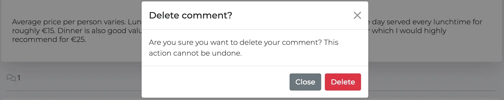

# Letters from Zaragoza

Letters from Zaragoza is a restaurant guide app for Zaragoza (a city in the north-east of Spain). The app is targeted towards users who enjoy their food and want to learn more about the best restaurants in Zaragoza!

The site displays a blog of the best restaurants by category in the city (e.g. best pizza, best hamburger, best fine dining etc).

The live link can be found here - [Letters from Zaragoza](https://letters-from-zaragoza-663ab0086474.herokuapp.com/).

---

## 📚 Table of Contents

- [Letters from Zaragoza](#letters-from-zaragoza)
- [User Stories](#user-stories)
- [Design](#design)
  - [Colour Scheme](#colour-scheme)
  - [Imagery](#imagery)
  - [Fonts](#fonts)
  - [Wireframes](#wireframes)
- [Agile Methodology](#agile-methodology)
- [Data Model](#data-model)
- [Testing](#testing)
- [Security Features and Defensive Design](#security-features-and-defensive-design)
  - [User Authentication](#user-authentication)
  - [Password Management](#password-management)
  - [Form Validation](#form-validation)
  - [Database Security](#database-security)
- [Features](#features)
  - [Header and Navigation Bar](#header-and-navigation-bar)
  - [Footer](#footer)
  - [Home Page](#home-page)
  - [Browse Restaurants](#browse-restaurants)
  - [Restaurant Detail Page](#restaurant-detail-page)
  - [Favourites Page](#favourites-page)
  - [Contact Form](#contact-form)
  - [About](#about)
  - [User Account Pages](#user-account-pages)
- [Future Features](#future-features)
- [Deployment to Heroku](#deployment-to-heroku)
- [Forking this Repository](#forking-this-repository)
- [Cloning this Repository](#cloning-this-repository)
- [Languages](#languages)
- [Frameworks - Libraries - Programs Used](#frameworks---libraries---programs-used)
- [Credits](#credits)
- [Acknowledgments](#acknowledgments)

---

### User Stories

#### EPIC | User Profile
- As a Site User I can register an account so that I can comment on posts.
- As a Site User I can login/logout of my account so that I can keep my account secure.
- As a Site User I can view my login status so that I know whether I am logged in or not.

#### EPIC | User Navigation
- As a Site User I can access the homepage and immediately understand the purpose of the site.
- As a Site User I can easily navigate the site so that I do not get easily lost and I know where I am.
- As a Site User I can view a list of the best restaurants by category so that I can select a review to read.
- As a Site User I can click on a review on the restaurants page so that I can know more about the restaurant.  

#### EPIC | Review Interaction
- As a Site User I can comment on a restaurant review so that I can give my feedback.
- As a Site User I can edit and delete comments so that I can easily make changes if I made a mistake. 
- As a Site Admin I can review or disapprove comments so that only appropriate comments are displayed on the site.

#### EPIC | Review Management
- As a Site Admin I can create, read, update and delete reviews so that I can manage my content.
- As Site Admin I can mark my reviews as 'save for later' or 'publish now' depending on whether they are finished or not.

#### EPIC | About Letters from Zaragoza
- As a site user I can click on the About link so that I can read about the site.
- As a Site Admin I can create or update the about page content so that it is available on the site.

#### EPIC | Contact
- As a site user I can contact the site owner via the contact form so that I can make suggestions/propose collaboration opportunities.
- As a site owner I can monitor contact requests via a database so that I can keep track of contact requests.
- As a site owner I can mark each contact request as read once complete so that I can keep track of my progress.

#### EPIC | Celebrate Restaurant Reviews
- As a Site User I can like or unlike a restaurant review so that I can interact with posts
- As a Site User I can add/remove restaurants from my favourites so that I can be reminded which restaurants I like

---

### Design
When picking the colours for the website I researched a number of food blogs. I noticed that on the majority of these websites minimal colour was used. This allows the images of the food to really shine.  

#### Colour Scheme
Colour palette from Coolors


The colours I chose are quite neutral. I have predominently kept the backgrounds white or close to white and then I picked variations on greens and beiges.

Great care was taken to establish a good contrast between background colours and text at all times to ensure maximum user accessibility. This was tested using Lighthouse.

#### Imagery
All images come from admin user uploads. The images are all my own and they are served via Cloudinary. The images are filled with colour to make the food appetising.

#### Fonts
The Montserrat font is the main font used for the body of the website. The Imperial Script font was used for the name of the restaurant on the restaurant detail page. This font gives an 'upmarket' feel. These fonts were imported via Google Fonts. Sans Serif is the backup font, in case for any reason the main font isn't being imported into the site correctly.

#### Wireframes

Below are the wireframes which I prepared before starting the project. Naturally the wireframes are slightly different to the final product but they served as a really good means to plan out the project.

<details>

 <summary>Landing Page</summary>


- An about section and a map/contact section was also included on the landing page in the end.
</details>

<details>

<summary>Restaurants</summary>


</details>


<details>

<summary>Restaurant Detail</summary>


- Originally my restaurant model contained an opening hours section but in the end I didn't think it was necessary.
- The comment form was changed to a model to make the restaurant detail page look cleaner.
</details>

<details>

<summary>Login</summary>


- Social media login was not implemented but this is something I would like to implement in the future as noted in the 'Future Features' section.
</details>

<details>

<summary>Contact</summary>


</details>

---

## Agile Methodology

Github projects was used to manage the development process using an agile approach. Please see link to project board [here](https://github.com/users/cgrace0044/projects/5/views/1)

The project board is very effective as it allows the project manager to move issues between 'To Do', 'In Progress' and 'Done':


The below epics (as detailed above) were documented in Github projects as milestones:
- User Profile
- User Navigation
- Review Interaction
- Review Management
- About Letters from Zaragoza
- Contact
- Celebrate Reviews

Each epic has a number of user stories which are broken down into acceptance criteria and further broken down as tasks. Once tasks were complete they were marked as done within the checklist. Issues were moved to 'Done' within the project board once complete. 

---

## Data Model
Please see the database schema created for the project below: 


The database schema outlines the structure and relationships between key tables for the platform. This schema was generated using Lucidchart.

- The Restaurant model was created to provide the structure of restaurant reviews on the website.
- The Comment model allows the user to comment on restaurant reviews.
- The About model outlines the structure for the about section on the homepage.
- Django AllAuth was used for the user authentication system.
- The Contact model creates the structure for the contact form.

---

## Testing

Testing and results can be found [here](/testing.md)

---

## Security Features and Defensive Design

### User Authentication

- Django's @loginrequired decorator was used to only allow certain access to logged in users (e.g. favourites, likes, comments etc).
- Some HTML only displays to logged in users using 'if user is authenticated' functionality.

### Password Management
- Django enforces strong password policies to enhance user account security.

### Form Validation
If incorrect or empty data is added to a form, the form won't submit and a warning will appear to the user informing them what field raised the error. 

### Database Security
The database url and secret key are stored in the env.py file to prevent unwanted connections to the database and this was set up before the first push to Github.

Cross-Site Request Forgery (CSRF) tokens were used on all forms throughout this site to enhance security.

### Google Maps API Key
Google Maps API key is restricted to certain domains. Therefore although it is public is cannot be used by others.

---

## Features

### Header and Navigation Bar


- The logo section of the navbar simply contains the name **Letters From Zaragoza** - links to the home page.
- The navigation bar is very clean cut. This is on purpose so that the user is drawn towards the restaurant images.
- The navigation bar is present at the top of every page.
- On hover the link font slightly darkens.
- When the user is logged in their username will show in the navbar together with a dropdown to their favourites and a logout option.
- When the user is not logged in links to the login and register pages will show (as below).


- The navigation bar is fully responsive and converts to a hamburger icon on small screens.

### Footer

- The footer contains a span stating *Follow Our tasty Zaragoza journey*.
- Links to **Twitter**, **Instagram**, **Facebook** and **Youtube** are also included.
- Clicking the links in the footer opens separate tabs.

### Home Page
**Hero Section**


- The home page includes a hero section which encourages the user to *discover the best restaurants in Zaragoza, Spain*.
- The hero section includes a carousel which contains images of some of the restaurants that are reviewed on the site.

**Get Started Section**


- The Get Started section contains a brief overview of what the site offers with links to restaurants, contact, about and login.
- The links are contained within **Font Awesome** icons.
- If the user is already authenticated the login link does not appear.
- The about section is an anchor link since this section is also on the landing page.

**About Section**


- The about section contains two separate parts: **About Zaragoza** and **About Me**.
- The text is separated by a **featured restaurants section**. In the admin panel of the restaurant model the admin user can choose to check the featured checkbox. Doing this will make the restaurants appear here in this 'featured restaurants' section. The restaurants are clickable and will bring you to the restaurant detail page.


**Map/Contact Section**


- Below the about section there is a map marking where Letters From Zaragoza is located. This is done via an integration with the Google Maps API. 
- It is not necessary to hide Google Maps API keys. However I have restricted the usage to specific domains. 
- There is an email address shown. When clicked the email link opens an email window with the 'To' field automatically populated with the Letters From Zaragoza email address.

### Browse Restaurants


- The **Restaurants page** contains cards for the best restaurant by category in Zaragoza (e.g. best burger, best ramen etc).
- **Pagination** shows eight reviews per page, with a link to the next page at the bottom.
- A **back button** also displays on the second page or more.
- **Each restaurant card** includes 
  - the post title
  - the restaurant name and 
  - an image of the restaurant
- Only **published reviews** are shown. Clicking anywhere inside the card will take the user to the detailed restaurant review.

### Restaurant Detail Page
**Masthead Section**


- The masthead section of each restaurant review contains 
  - the post title
  - the restaurant name 
  - an add to favourites button
  - a like button
- The **Add To Favourites** button and the **Like** button only appears if the user is logged in.
- If a user clicks **Add To Favourites** or **Like** they will be informed of the same via Django messages.
- If the user is **not logged in** a link to the login page appears.

**Restaurant Details Card**


- Each detailed restaurant card contains the restaurant location, price, description and restaurant image.
- On hover there is a nice box shadow effect to make the card stand out.

**Comments Section**


- The comments section starts with a Font Awesome comments symbol together with a comment counter.
- Below there is a **make a comment card**. Clicking on *write a comment* opens the comment modal.
- Making a comment is only available to logged in users.
- Below there is a second card which contains the comments already made.
- Users will see all approved comments plus their own comments which have yet to have been approved.
- Each comment contains the username, the date and the time together with the comment.
- Users' own comments will also provide the user the opportunity to **edit** or **delete** comments.
    - clicking **Edit** will open the comment modal and will prepopulate the existing comment.
    - clicking **Delete** will bring the user to a delete confirmation modal. 

**Comments Modal**


- The comment modal contains a body textfield together with a **Submit** and **Close** button.
- Clicking **Submit** will inform the user that their comment is awaiting approval.
- Clicking **Close** will take the user back to the restaurant review.

**Delete Confirmation Modal**



- If a user chooses to delete a comment they are asked if they are sure via a delete confirmation modal. 

### Favourites Page


- A link to the favourites page becomes visible within the user profile dropdown in the navigation bar when the user is logged in.
- This page will show any restaurant that the user has added to their favourites.
- Clicking anywhere inside cards will bring the user to the detailed restaurant page - there the user can remove the restaurant from their favourites if they wish. 

### Contact Form


- The contact form has three fields; name, email and message.
- All fields are mandatory. If one is left blank the form won't submit and an error message is shown.
- If the user is logged in their email address will automatically populate. This is so we don't ask the user for the same information twice.
- When the form is submitted a success message is shown to say the message was sent successfully. 

### User Account Pages

**Register**


**Log In**


**Log Out**


- Django allauth was installed and used to create the Register, Log in and Log out functionality. 
- Messages confirm to the user when they have logged in/logged out successfully. 

---

### Future Features
- Within the login page I would like to implement social media login.
- Within the contact form it would be good to have a calendar system to allow potential collaborators to setup a meeting.
- A page outlining potential foodie trips you could do within driving distance of Zaragoza.

---

## Deployment to Heroku

To deploy your Django app to Heroku, follow the steps below:

### 1. Prepare the Application

- Update `requirements.txt` by running:  
  ```bash
  pip3 freeze > requirements.txt
  ```
  Heroku uses this file to install dependencies.

### 2. Create a Heroku App

1. Log in or sign up at [Heroku](https://heroku.com).
2. From the Heroku Dashboard, click **"Create New App"**.
3. Choose a unique app name and select your region.
4. Click **"Create App"** to proceed.

### 3. Attach a Postgres Database

1. In the app dashboard, go to the **"Settings"** tab.
2. Scroll to **"Config Vars"** and click **"Reveal Config Vars"**.
3. Add a new key-value pair:
   - **Key:** `DATABASE_URL`
   - **Value:** Your Postgres database URL.

### 4. Configure Environment and `settings.py`

- Create an `env.py` file in your project root:
  ```python
  import os

  os.environ['SECRET_KEY'] = 'your-secret-key'
  os.environ['DATABASE_URL'] = 'your-database-url'
  os.environ['CLOUDINARY_URL'] = 'your-cloudinary-url'
  ```
- Comment out the default database configuration from Django.
- Save files and make migrations.
- Add the cloudinary libraries to the list of installed apps.
- Add the STATIC files settings - the url, storage path, directory path, root path, media url and default file storage path.
- Link the file to the templates directory in Heroku.
- Change the templates directory to TEMPLATES_DIR
- Add your Heroku app to `ALLOWED_HOSTS`:
    ```python
    ALLOWED_HOSTS = ['your-app-name.herokuapp.com', 'localhost']
    ```
### 5. Create a `Procfile`

- In the project root, create a file named `Procfile` (no extension) with:
  ```
  web: gunicorn project_name.wsgi
  ```

### 6. Set Config Vars on Heroku

In the **Config Vars** section of your Heroku app, add:

- `SECRET_KEY`
- `CLOUDINARY_URL`
- `DATABASE_URL`

### 9. Connect to GitHub & Deploy

1. Go to the **Deploy** tab.
2. Select **GitHub** as your deployment method.
3. Search for your repository and click **Connect**.
4. Choose your deployment method:
   - **Enable Automatic Deploys** *(recommended)*, or
   - **Manual Deploy** from the `main` branch.
5. Click **Deploy Branch** to start deployment.
6. Once deployment completes, click **"View"** to access your live site.

Important!: Verify that the DEBUG setting is set to False, and the requirements.txt and Procfile are up to date and committed to GitHub.

### Your Site is Now Live!

Your Django app is now deployed and operational on Heroku.

---

## Forking this Repository

To fork the repository:

1. Visit the repository: [Letters from Zaragoza](https://github.com/cgrace0044/pp4_zaragoza_restaurants).
2. Click the **Fork** button in the upper-right corner of the page.
3. This will create a copy of the repository under your own GitHub account.

---

## Cloning this Repository

To clone the repository to your local machine:

1. Go to the repository: [Letters from Zaragoza](https://github.com/cgrace0044/pp4_zaragoza_restaurants).
2. On the main page, click the **Code** button.
3. Copy the provided URL (use HTTPS or SSH).
4. Open your **Terminal** or **Command Prompt**.
5. Navigate to the directory where you want the cloned folder to be created.
6. Run the following command:

   ```bash
   git clone https://github.com/your-username/pp4_zaragoza_restaurants.git

---

## Languages

- [Python](https://www.python.org/) 
- [Markdown](https://en.wikipedia.org/wiki/Markdown)
- [HTML](https://developer.mozilla.org/en-US/docs/Glossary/HTML5 "HTML")
- [CSS](https://developer.mozilla.org/en-US/docs/Web/CSS "CSS")
- [JS](https://developer.mozilla.org/en-US/docs/Web/JavaScript "JS")

---

## Frameworks - Libraries - Programs Used
- [Django](https://www.djangoproject.com/): Main python framework used in the development of this project
- [Django-allauth](https://django-allauth.readthedocs.io/en/latest/installation.html): authentication library used to create the user accounts
- [PostgreSQL](https://www.postgresql.org/) was used as the database for this project.
- [Heroku](https://dashboard.heroku.com/login) - was used as the cloud based platform to deploy the site on.
- [Responsinator](http://www.responsinator.com/) - Used to verify responsiveness of website on different devices.
- [Balsamiq](https://balsamiq.com/) - Used to generate Wireframe images.
- [Chrome Dev Tools](https://developer.chrome.com/docs/devtools/) - Used for overall development and tweaking, including testing responsiveness and performance.
- [Font Awesome](https://fontawesome.com/) - Used for various icons throughout the site.
- [GitHub](https://github.com/) - Used for version control and agile tool.
- [Google Fonts](https://fonts.google.com/) - Used to import and alter fonts on the page.
- [W3C](https://www.w3.org/) - Used for HTML & CSS Validation.
- [PEP8 Online](http://pep8online.com/) - used to validate all the Python code
- [Jshint](https://jshint.com/) - used to validate javascript
- [Coolors](https://coolors.co/) - Used to create colour palette.
- [Favicon](https://favicon.io/) - Used to create the favicon.
- [Lucidchart](https://lucid.app/documents#/dashboard) - used to create the database schema design
- [Summernote](https://summernote.org/): A WYSIWYG editor
- [Cloudinary](https://cloudinary.com/): the image hosting service used to upload images
- [Bootstrap 5](https://getbootstrap.com/docs/5.0/getting-started/introduction/): CSS Framework for developing responsiveness and styling
- [Crispy Forms](https://django-crispy-forms.readthedocs.io/en/latest/): Used to manage Django forms, making form rendering in templates simpler and more elegant.

---

## Credits

- [W3Schools](https://www.w3schools.com/)
- [Django Docs](https://docs.djangoproject.com/en/4.0/)
- [Bootstrap 5 Docs](https://getbootstrap.com/docs/5.0/getting-started/introduction/)
- [Stack Overflow](https://stackoverflow.com/)
- [Unsplash](https://unsplash.com/): The paella image on the site was sourced from unsplash.com
- [Pexels](https://www.pexels.com/): The image of the Pilar cathedral in Zaragoza was sourced from Pexels. This is a default image on the site - used if other images won't upload.
- [Code Institute - Blog Walkthrough Project](https://github.com/Code-Institute-Solutions/django-blog-sourcecode)

---

## Acknowledgments

Many thanks to my mentor Simen Daehlin for his support and advice. Thank you also to the Code Institute Slack community - a quick search on here often resolved many of the bugs I had. Thanks to my family for their support during this project. 

---