### 📑 Table of Contents

- [EPIC 1 | User Profile](#epic-1--user-profile)
- [EPIC 2 | User Navigation](#epic-2--user-navigation)
- [EPIC 3 | Review Interaction](#epic-3--review-interaction)
- [EPIC 4 | Review Management](#epic-4--review-management)
- [EPIC 5 | About Letters from Zaragoza](#epic-5--about-letters-from-zaragoza)
- [EPIC 6 | Contact](#epic-6--contact)
- [EPIC 7 | Celebrate Restaurant Reviews](#epic-7--celebrate-restaurant-reviews)
- [Lighthouse](#lighthouse)
- [Manual Testing](#manual-testing)
  - [Site Navigation](#site-navigation)
  - [Home Page](#home-page)
  - [Restaurants Page](#restaurants-page)
  - [Restaurant Detail Page](#restaurant-detail-page)
  - [Contact Form](#contact-form)
  - [About Section](#about-section)
  - [Django All Auth Pages](#django-all-auth-pages)
- [Bugs](#bugs)
  - [Fixed Bugs](#fixed-bugs)
  - [Unfixed Bugs](#unfixed-bugs)

## User Story Testing

### EPIC 1 | User Profile

| User Story                                                                                   | Complete | Link |
|----------------------------------------------------------------------------------------------|----------|------|
| As a Site User I can register an account so that I can comment on posts.                    | ✅        | 

View Story
 [User Story – Register & Comment](https://github.com/cgrace0044/pp4_zaragoza_restaurants/issues/15)
 |
| As a Site User I can login/logout of my account so that I can keep my account secure.       | ✅        | 

View Story
 [User Story – Login/Logout](https://github.com/cgrace0044/pp4_zaragoza_restaurants/issues/16)
 |
| As a Site User I can view my login status so that I know whether I am logged in or not.     | ✅        | 

View Story
 [User Story – View Login Status](https://github.com/cgrace0044/pp4_zaragoza_restaurants/issues/17)
 |

---

#### 🧪 User Story 1: Register an Account to Comment on Posts

**As a Site User I can register an account so that I can comment on posts.**

- Users can register on the **Register** page.
- They are encouraged to do this on the landing page within the **Get Started** section.

📸 View Screenshot – Register Page

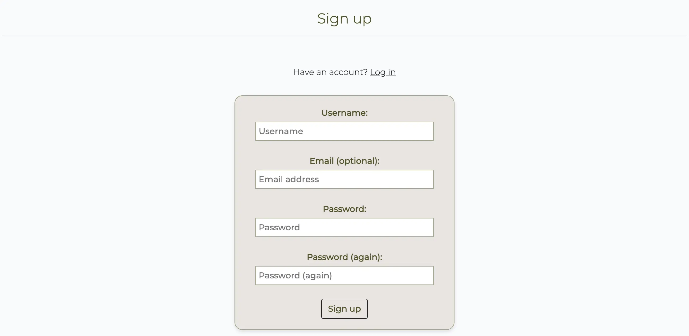

- Only **authenticated users** can comment on posts.

📸 View Screenshot – Commenting as Logged-In User

---

#### 🧪 User Story 2: Login/Logout Functionality

**As a Site User I can login/logout of my account so that I can keep my account secure.**

- Users can log in via the **Login** page.

📸 View Screenshot – Login Page

- Once logged in, a **logout dropdown** appears in the navigation bar.

📸 View Screenshot – Logout Dropdown

---

#### 🧪 User Story 3: View Login Status

**As a Site User I can view my login status so that I know whether I am logged in or not.**

- When logged in, the **username appears** in the navigation bar.

📸 View Screenshot – Logged-In Navigation

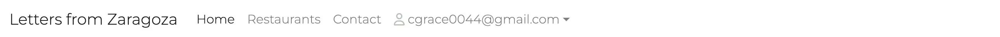

- When not logged in, the navigation bar reflects this accordingly by providing login/register options.

📸 View Screenshot – Logged-Out Navigation

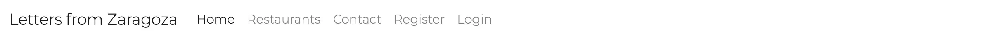

---

### EPIC 2 | User Navigation

| User Story                                                                                                   | Complete | Link |
|-------------------------------------------------------------------------------------------------------------|----------|------|
| As a Site User I can access the homepage and immediately understand the purpose of the site.                | ✅        | 

View Story
 [User Story – Homepage Purpose](https://github.com/cgrace0044/pp4_zaragoza_restaurants/issues/18)
 |
| As a Site User I can easily navigate the site so that I do not get easily lost and I know where I am.       | ✅        | 

View Story
 [User Story – Site Navigation](https://github.com/cgrace0044/pp4_zaragoza_restaurants/issues/19)
 |
| As a Site User I can view a list of the best restaurants by category so that I can select a review to read. | ✅        | 

View Story
 [User Story – Restaurant List](https://github.com/cgrace0044/pp4_zaragoza_restaurants/issues/20)
 |
| As a Site User I can click on a review on the restaurants page so that I can know more about the restaurant.| ✅        | 

View Story
 [User Story – View Restaurant Detail](https://github.com/cgrace0044/pp4_zaragoza_restaurants/issues/21)
 |

---

#### 🧪 User Story 4: Understand the Purpose of the Site

**As a Site User I can access the homepage and immediately understand the purpose of the site.**

- Clear **hero section** with a short tagline explaining the site.
- "Get Started" section includes helpful links to direct the user.
- There is also an About section (explained in Epic 5 below)

📸 View Screenshot – Homepage Hero & Get Started

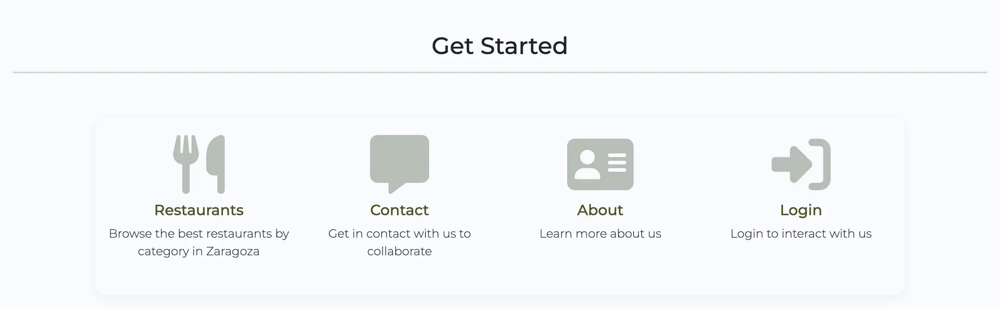

---

#### 🧪 User Story 5: Navigate the Site with Ease

**As a Site User I can easily navigate the site so that I do not get easily lost and I know where I am.**

- The same **navigation bar** appears on all pages.
- The current page is **clearly highlighted** using bold/darkened text.

📸 View Screenshot – Navigation Bar Highlight

---

#### 🧪 User Story 6: View Restaurants by Category

**As a Site User I can view a list of the best restaurants by category so that I can select a review to read.**

- The **Restaurants** page categorizes all reviews clearly.
- Page layout is simple and focused for easy scanning.

📸 View Screenshot – Restaurants by Category

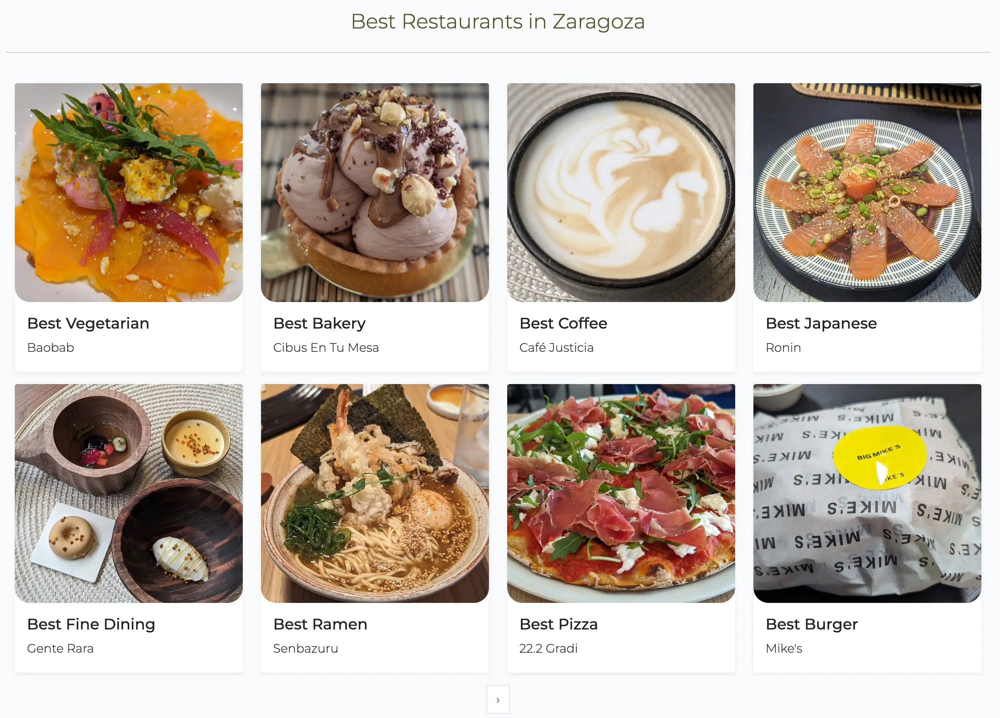

---

#### 🧪 User Story 7: Access Restaurant Review Details

**As a Site User I can click on a review on the restaurants page so that I can know more about the restaurant.**

- All restaurant links have been **validated** and lead to the correct review page.
- Review pages contain detailed restaurant information.

📸 View Screenshot – Restaurant Detail Page

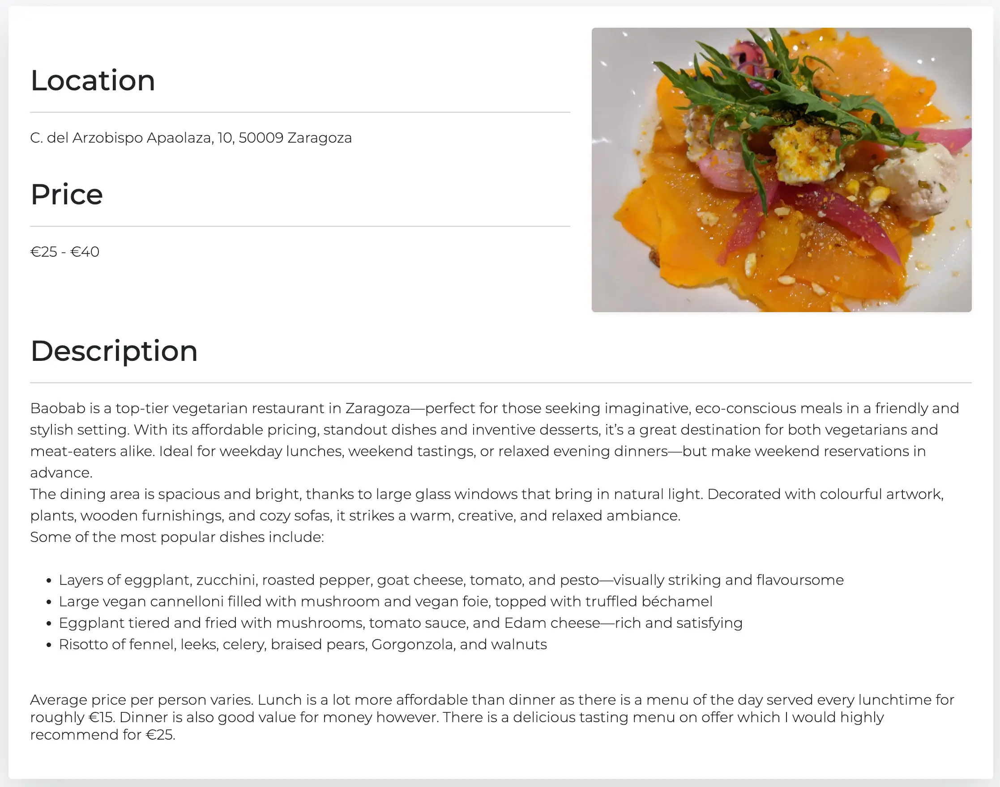

---

### EPIC 3 | Review Interaction

| User Story                                                                                                    | Complete | Link |
|--------------------------------------------------------------------------------------------------------------|----------|------|
| As a Site User I can comment on a restaurant review so that I can give my feedback.                         | ✅        | 

View Story
 [User Story – Comment on Review](https://github.com/cgrace0044/pp4_zaragoza_restaurants/issues/22)
 |
| As a Site User I can edit and delete comments so that I can easily make changes if I made a mistake.        | ✅        | 

View Story
 [User Story – Edit/Delete Comments](https://github.com/cgrace0044/pp4_zaragoza_restaurants/issues/23)
 |
| As a Site Admin I can review or disapprove comments so that only appropriate comments are displayed.        | ✅        | 

View Story
 [User Story – Approve Comments](https://github.com/cgrace0044/pp4_zaragoza_restaurants/issues/24)
 |

---

#### 🧪 User Story 8: Comment on a Restaurant Review

**As a Site User I can comment on a restaurant review so that I can give my feedback.**

- Only logged-in users can comment.
- A **comment modal** appears when clicking "Write a Comment".

📸 View Screenshot – Comment Modal (Logged In)

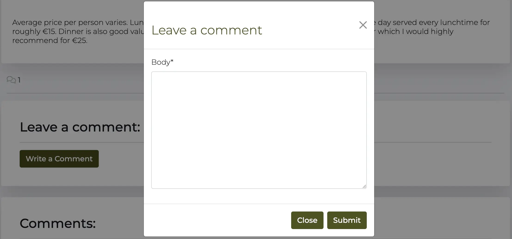

- Non-logged-in users are prompted to log in.

📸 View Screenshot – Comment Blocked (Not Logged In)

---

#### 🧪 User Story 9: Edit and Delete Comments

**As a Site User I can edit and delete comments so that I can easily make changes if I made a mistake.**

- Logged-in users see **Edit** and **Delete** options on their own comments.

📸 View Screenshot – Edit/Delete Buttons

---

#### 🧪 User Story 10: Approve/Disapprove Comments

**As a Site Admin I can review or disapprove comments so that only appropriate comments are displayed on the site.**

- Admin moderation is done through the **Django admin panel**.

📸 View Screenshot – Admin Comment Moderation

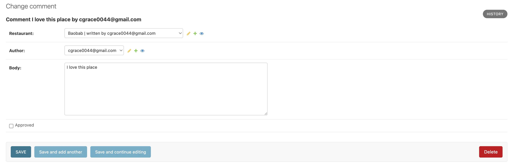

---

### EPIC 4 | Review Management

| User Story                                                                                                                | Complete | Link |
|---------------------------------------------------------------------------------------------------------------------------|----------|------|
| As a Site Admin I can create, read, update and delete reviews so that I can manage my content.                          | ✅        | 

View Story
 [User Story – Manage Reviews](https://github.com/cgrace0044/pp4_zaragoza_restaurants/issues/25)
 |
| As Site Admin I can mark reviews as 'save for later' or 'publish now' depending on whether they are finished or not.     | ✅        | 

View Story
 [User Story – Draft/Publish](https://github.com/cgrace0044/pp4_zaragoza_restaurants/issues/26)
 |

---

#### 🧪 User Story 11: Manage Reviews via Admin

**As a Site Admin I can create, read, update and delete reviews so that I can manage my content.**

- Full CRUD functionality available through **Django admin**.
- By clicking on the restaurant model and selecting any of the restaurant reviews the below panel is available at the bottom of the page.

📸 View Screenshot – Review Admin Panel

---

#### 🧪 User Story 12: Save Draft or Publish Reviews

**As Site Admin I can mark reviews as 'save for later' or 'publish now'.**

- **Draft/Published** toggle available in the review form when logged into Django Admin restaurant model.

📸 View Screenshot – Draft vs Publish Option

---

### EPIC 5 | About Letters from Zaragoza

| User Story                                                                                      | Complete | Link |
|--------------------------------------------------------------------------------------------------|----------|------|
| As a Site User I can click on the About link to learn more about the site.                      | ✅        | 

View Story
 [User Story – About Page](https://github.com/cgrace0044/pp4_zaragoza_restaurants/issues/27)
 |
| As a Site Admin I can update the About page content.                                             | ✅        | 

View Story
 [User Story – Update About Content](https://github.com/cgrace0044/pp4_zaragoza_restaurants/issues/28)
 |

---

#### 🧪 User Story 13: View About Page

**As a Site User I can click on the About link to learn more about the site.**

- Contains **intro text**, **contact info**, and a **map location**. This is all located on the home page (the about link is an anchor link)

📸 View Screenshot – About Page

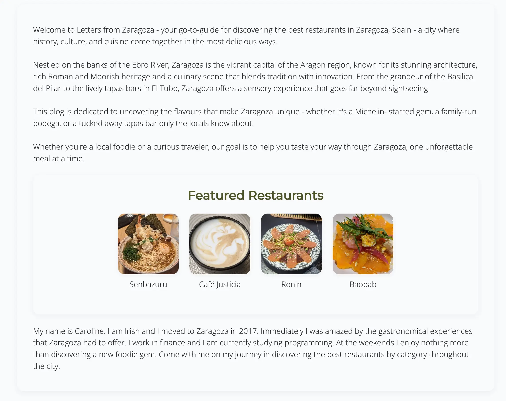

---

#### 🧪 User Story 14: Update About Page Content

**As a Site Admin I can update the About page content.**

- About content editable via **Django admin** under the "About" model.

📸 View Screenshot – About Page Admin

---

### EPIC 6 | Contact

| User Story                                                                                                                         | Complete | Link |
|------------------------------------------------------------------------------------------------------------------------------------|----------|------|
| As a Site User I can contact the site owner via a form.                                                                           | ✅        | 

View Story
 [User Story – Contact Form](https://github.com/cgrace0044/pp4_zaragoza_restaurants/issues/29)
 |
| As a Site Owner I can monitor contact requests via a database.                                                                   | ✅        | 

View Story
 [User Story – Contact Dashboard](https://github.com/cgrace0044/pp4_zaragoza_restaurants/issues/30)
 |
| As a Site Owner I can mark contact requests as read once complete.                                                               | ✅        | 

View Story
 [User Story – Mark Read](https://github.com/cgrace0044/pp4_zaragoza_restaurants/issues/31)
 |

---

#### 🧪 User Story 15: Submit Contact Form

**As a Site User I can contact the site owner via a form.**

- **Name**, **email**, and **message** fields are included.
- Used to send **suggestions or collaboration requests**.

📸 View Screenshot – Contact Form

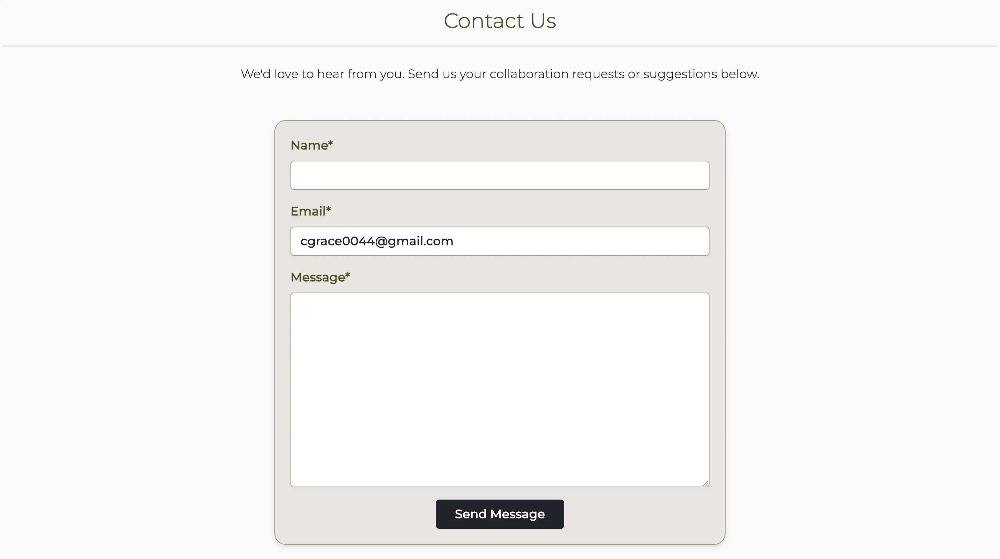

---

#### 🧪 User Story 16: Monitor Contact Requests

**As a Site Owner I can monitor contact requests via a database.**

- All messages are stored and visible in **Django admin**.

📸 View Screenshot – Contact Admin View

---

#### 🧪 User Story 17: Mark Contact Requests as Read

**As a Site Owner I can mark contact requests as read.**

- Checkbox for marking **read/unread status** is available.

📸 View Screenshot – Mark as Read

---

### EPIC 7 | Celebrate Restaurant Reviews

| User Story                                                                                                          | Complete | Link |
|--------------------------------------------------------------------------------------------------------------------|----------|------|
| As a Site User I can like or unlike a restaurant review to interact with posts.                                   | ✅        | 

View Story
 [User Story – Like Reviews](https://github.com/cgrace0044/pp4_zaragoza_restaurants/issues/32)
 |
| As a Site User I can add/remove restaurants from favourites to keep track of the ones I enjoy.                    | ✅        | 

View Story
 [User Story – Favourite Reviews](https://github.com/cgrace0044/pp4_zaragoza_restaurants/issues/33)
 |

---

#### 🧪 User Story 18: Like/Unlike Restaurant Reviews

**As a Site User I can like or unlike a restaurant review to interact with posts.**

- Like/unlike available on each **restaurant detail page**.
- Only visible to **logged-in users**.

📸 View Screenshot – Like Button

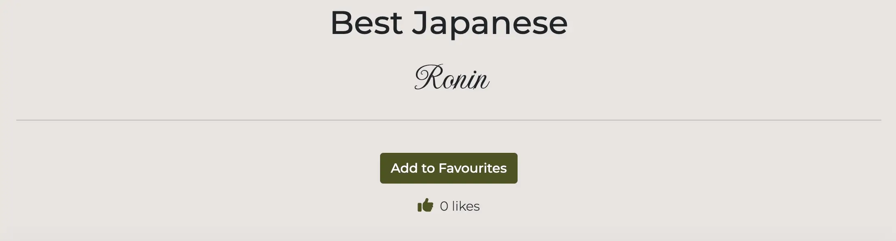

---

#### 🧪 User Story 19: Add/Remove from Favourites

**As a Site User I can add/remove restaurants from favourites.**

- Favourites toggle appears on **restaurant detail page**.
- Accessible from **user’s account** or profile area.

📸 View Screenshot – Favourite Button

### Lighthouse

Lighthouse validation was run on all pages (both mobile and desktop) in order to check accessibility and performance. 

| Page           | Performance  | Accessibility | Best Practices  | SEO |
|----------------|:------------:|:-------------:|:---------------:|:---:|
|                |              |               |                 |     |
| Desktop        |              |               |                 |     |
| Home           |           87 |           100 |             100 | 100 |
| Restaurants    |           99 |           100 |             100 | 100 |
| Rest Detail    |           96 |           100 |             100 | 100 |
| About          |           77 |           100 |             100 | 100 |
| Contact        |           99 |           100 |             100 | 100 |
| Favourites     |           85 |           100 |             100 | 100 |
| Login          |           100|           100 |             100 | 100 |
| Logout         |           98 |           100 |             100 | 100 |
| Register       |           98 |           100 |             100 | 100 |
|                |              |               |                 |     |
| Mobile         |              |               |                 |     |
| Home           |           75 |           100 |             100 | 100 |
| Restaurants    |           89 |           100 |             100 | 100 |
| Rest Detail    |           72 |           100 |             100 | 100 |
| About          |           89 |           100 |             100 | 100 |
| Contact        |           93 |           100 |             100 | 100 |
| Favourites     |           84 |           100 |             100 | 100 |
| Login          |           93 |           100 |             100 | 100 |
| Logout         |           94 |           100 |             100 | 100 |
| Register       |           94 |           100 |             100 | 100 |

---

## Manual Testing

### Site Navigation
| Element               | Action     | Expected Result                                                      | Pass/Fail |
|-----------------------|------------|----------------------------------------------------------------------|-----------|
| NavBar                |            |                                                                      |           |
| Site Name (logo area) | Click      | Redirect to home                                                     | Pass      |
| Home Link             | Click      | Redirect to home                                                     | Pass      |
| Restaurants Link      | Click      | Open Browse Restaurants page                                         | Pass      |
| About Link            | Click      | Open About page                                                      | Pass      |
| Contact Link          | Click      | Open Contact page                                                    | Pass      |
| Register Link         | Display    | Not visible if user logged in                                        | Pass      |
| Register Link         | Click      | Open Register page                                                   | Pass      |
| Login Link            | Display    | Not visible if user logged in                                        | Pass      |
| Login Link            | Click      | Open Login page                                                      | Pass      |
| Login Link            | Display    | Changes to profile name when user logged in with dropdown menu       | Pass      |
| Favourites Link       | Display    | Only visible if user logged in                                       | Pass      |
| Favourites Link       | Click      | Open Favourites page                                                 | Pass      |
| Logout Link           | Display    | Only visible if user logged in                                       | Pass      |
| Logout Link           | Click      | Open logout confirmation page                                        | Pass      |
| All Nav Links         | Hover      | Slightly darker text                                                 | Pass      |
| Hamburger Menu        | Responsive | Display when screen size reduces to tablet                           | Pass      |
| My Account Dropdown   | Responsive | Contents move into hamburger menu when screen size reduces to medium | Pass      |
|                       |            |                                                                      |           |
| Footer                |            |                                                                      |           |
| All links             | Click      | Open in new tab and to correct location                              | Pass      |

### Home Page
| Element                    | Action                                    | Expected Result                            | Pass/Fail |
|----------------------------|-------------------------------------------|--------------------------------------------|-----------|
| G. Started Restaurants Link| Click                                     | Redirect to browse_restaurants page        | Pass      |
| G. Started Contact Link    | Click                                     | Redirect to contact page                   | Pass      |
| G. Started About Link      | Click                                     | Redirect to about page                     | Pass      |
| G. Started Login Link      | Click                                     | Redirect to login page                     | Pass      |
| G. Started Links           | Hover                                     | On hover get started links go darker green | Pass      |
| Login link                 | Logged in/ Logged out                     | login link only displays when not logged in| Pass      |

### Restaurants Page
| Element                    | Action                         | Expected Result                                                             | Pass/Fail |
|----------------------------|--------------------------------|-----------------------------------------------------------------------------|-----------|
| Restaurant Card            | Display correct content        | Displays correct title, restaurant name and image                           | Pass      |
| Restaurant Card            | Click                          | Clicking inside restaurant card brings you to correct restaurant detail page| Pass      |
| Restaurant Card            | Pagination                     | 8 restaurant cards will appear per page                                     | Pass      |
| Restaurant Card            | Hover                          | Hovering over a restaurant card creates the desired box shadow effect       | Pass      |
| Restaurant Card            | Media Display                  | 4 restaurants appearing per row on desktop, 3 on tablet and one on mobile   | Pass      |
| Link                       | Pagination link                | Pagination arrow takes you to the next set of restaurant reviews            | Pass      |
| Link                       | Pagination link                | On the second page or more a back arrow pagination button appears           | Pass      |
| Link                       | Pagination Hover               | Hovering over the pagination link creates the desired box shadow effect     | Pass      |

### Restaurant Detail Page
| Element                        | Action              | Expected Result                                                                                                         | Pass/Fail |
|--------------------------------|---------------------|-------------------------------------------------------------------------------------------------------------------------|-----------|
| Restaurant Review Content      | Display             | Display correct post title, restaurant name, location, price, description and restaurant image                          | Pass      |
| Add to favourites button       | Display             | Only visible if user is logged in                                                                                       | Pass      |
| Add to favourites button       | Hover               | Hovering over the add to favourites button creates the desired box shadow effect                                        | Pass      |
| Add to favourites button       | Click               | Restaurant is added to user's favourites page                                                                           | Pass      |
| Add to favourites button       | Click               | Success message appears informing the user that the 'restaurant name' has been added to their favourites                | Pass      |
| Add to favourites button       | Click               | Success message fades after 2 seconds                                                                                   | Pass      |
| Remove from favourites button  | Display             | Only visible if user is logged in                                                                                       | Pass      |
| Remove from favourites button  | Hover               | Hovering over the remove from favourites button creates the desired box shadow effect                                   | Pass      |
| Remove from favourites button  | Click               | Restaurant is removed from user's favourites page                                                                       | Pass      |
| Remove from favourites button  | Click               | Success message appears informing the user that the 'restaurant name' has been removed from their favourites            | Pass      |
| Remove from favourites button  | Click               | Success message fades after 2 seconds                                                                                   | Pass      |
| Like Button                    | Display             | Only visible if user is logged in                                                                                       | Pass      |
| Like Button                    | Hover               | Hovering over the like button creates the desired box shadow effect                                                     | Pass      |
| Like Button                    | Click               | Restaurant is liked by the user                                                                                         | Pass      |
| Like Button                    | Click               | Click the like button a second time and the restaurant is unliked by the user                                           | Pass      |
| Like Button                    | Click               | Like count is incremented by one when a user likes a post                                                               | Pass      |
| Like Button                    | Click               | Like count is decremented by one when a user unlikes a post                                                             | Pass      |
| Like Button                    | Click               | Success message appears informing the user they have liked the restaurant (restaurant is named)                         | Pass      |
| Like Button                    | Click               | Message appears informing the user they have unliked a restaurant (restaurant is named)                                 | Pass      |
| Like Button                    | Click               | Messages fade automatically after 2 seconds                                                                             | Pass      |
| Login to Interact Button       | Display             | Login to Interact Button appears instead of like/add to favourites buttons when user is not logged in                   | Pass      |
| Login to Interact Button       | Click               | User is redirected to login page                                                                                        | Pass      |
| Login to Interact Button       | Hover               | Hovering over the Login to Interact button creates the desired box shadow effect                                        | Pass      |
| Write a Comment Button         | Display             | Only displays if user is logged in                                                                                      | Pass      |
| Write a Comment Button         | Click               | Clicking on write a comment opens the 'leave a comment' modal                                                           | Pass      |
| Write a Comment Button         | Hover               | Hovering over the write a comment button creates the desired box shadow effect                                          | Pass      |
| Write a Comment Modal:Close    | Hover               | Hovering over the close button within the write a comment modal creates the desired box shadow effect                   | Pass      |
| Write a Comment Modal:Close    | Click               | Clicking on the close button within the write a comment modal returns the user to the restaurant detail page            | Pass      |
| Write a Comment Modal:Submit   | Leave empty         | On submit form won't submit                                                                                             | Pass      |
| Write a Comment Modal:Submit   | Leave empty         | Error message displays                                                                                                  | Pass      |
| Write a Comment Modal:Submit   | Hover               | Hovering over the submit button within the write a comment modal creates the desired box shadow effect                  | Pass      |
| Write a Comment Modal:Submit   | Click               | Clicking on the submit button within the write a comment modal returns the user to the restaurant detail page           | Pass      |
| Write a Comment Modal:Submit   | Click               | Clicking on the submit button adds the comment to the comments section. Below the comment it states awaiting approval   | Pass      |
| Write a Comment Modal:Submit   | Click               | Clicking on the submit button informs the user that their comment was submitted and is awaiting approval                | Pass      |
| Write a Comment Modal:Submit   | Click               | The comment submitted success message fades after 2 seconds                                                             | Pass      |
| User Comments                  | Display             | Comments are in ascending order                                                                                         | Pass      |
| User Comments                  | Display             | Comments display the username, the date, the time, the comment and if the comment is awaiting approval                  | Pass      |
| User Comments                  | Display             | If a comment is awaiting approval it is only visible by the comment author                                              | Pass      |
| Edit Comment Button            | Display             | Only displays if user is logged in and the user is the author of the comment                                            | Pass      |
| Edit Comment Button            | Click               | Clicking on 'edit' opens the 'leave a comment' modal with the author's comment already populated                        | Pass      |
| Edit Comment Button            | Hover               | Hovering over the 'edit' button creates the desired box shadow effect                                                   | Pass      |
| Delete Comment Button          | Display             | Only displays if user is logged in and the user is the author of the comment                                            | Pass      |
| Delete Comment Button          | Click               | Clicking on 'delete' opens the 'delete comment' modal asking the author if they are sure they want to delete            | Pass      |
| Delete Comment Button          | Hover               | Hovering over the 'delete' button creates the desired box shadow effect                                                 | Pass      |
| Delete Comment Modal:Close     | Click               | Clicking the close button within the modal dismisses the modal and returns the user to the restaurant detail page       | Pass      |
| Delete Comment Modal:Close     | Hover               | Hovering over the close button within the modal slightly changes the colour of the button                               | Pass      |
| Delete Comment Modal:Delete    | Click               | Clicking the delete button within the modal deletes the comment and returns the user to the restaurant detail page      | Pass      |
| Delete Comment Modal:Delete    | Hover               | Hovering over the delete button within the modal slightly changes the colour of the button                              | Pass      |
| Delete Comment Modal:Delete    | Click               | A sucess message appears stating that the comment has been deleted                                                      | Pass      |
| Delete Comment Modal:Delete    | Click               | The success message fades after 2 seconds.                                                                              | Pass      |

### Contact Form
| Element                    | Action                                    | Expected Result                            | Pass/Fail |
|----------------------------|-------------------------------------------|--------------------------------------------|-----------|
| Name field                 | Leave empty                               | On submit: form won't submit               | Pass      |
| Name field                 | Leave empty                               | Error message displays                     | Pass      |
| Name field                 | Insert correct format                     | On submit: form submit                     | Pass      |
| Email field                | Insert incorrect format                   | On submit: form won't submit               | Pass      |
| Email field                | Insert incorrect format                   | Error message displays                     | Pass      |
| Email field                | Insert correct format                     | On submit: form submit                     | Pass      |
| Message field              | Leave empty                               | On submit: form won't submit               | Pass      |
| Message field              | Leave empty                               | Error message displays                     | Pass      |
| Send message button        | Hover                                     | Cursor changes to pointer                  | Pass      |
| Send message button        | Click                                     | Success message confirming message sent    | Pass      |

### About Section
| Element                    | Action                       | Expected Result                                                          | Pass/Fail |
|----------------------------|------------------------------|--------------------------------------------------------------------------|-----------|
| About Content              | Display                      | Correct content displays: About Zaragoza, About Me, Location, Contact Us | Pass      |
| Google Map                 | Display                      | Google map displays with marker on Valdespartera location                | Pass      |
| Google Map                 | Hover                        | Cursor changes to pointer on hover over Google map                       | Pass      |
| Email address              | Hover                        | On hover email address changes to blue to show it is a link              | Pass      |
| Email address              | Click                        | On click a draft email is opened with the email address in the To field  | Pass      |

### Django All Auth Pages
| Element                    | Action                                    | Expected Result                            | Pass/Fail |
|----------------------------|-------------------------------------------|--------------------------------------------|-----------|
| Register                   |                                           |                                            |           |
| Log in link                | Click                                     | Redirect to login page                     | Pass      |
| Username field             | Leave empty                               | On submit: form won't submit               | Pass      |
| Username field             | Leave empty                               | Error message displays                     | Pass      |
| Username field             | Insert duplicate username                 | On submit: form won't submit               | Pass      |
| Username field             | Insert duplicate username                 | Error message displays                     | Pass      |
| Email field                | Insert incorrect format                   | On submit: form won't submit               | Pass      |
| Email field                | Insert incorrect format                   | Error message displays                     | Pass      |
| Email field                | Insert correct format                     | On submit: form submit                     | Pass      |
| Email field                | Leave empty - email field optional        | On submit: form submit                     | Pass      |
| Email field                | Insert duplicate email                    | On submit: form won't submit               | Pass      |
| Email field                | Insert duplicate email                    | Error message displays                     | Pass      |
| Password field             | Insert incorrect format                   | On submit: form won't submit               | Pass      |
| Password field             | Insert incorrect format                   | Error message displays                     | Pass      |
| Password field             | Passwords don't match                     | On submit: form won't submit               | Pass      |
| Password field             | Passwords don't match                     | Error message displays                     | Pass      |
| Password field             | Insert correct format and passwords match | On submit: form submit                     | Pass      |
| Sign Up button(form valid) | Click                                     | Form submit                                | Pass      |
| Sign Up button(form valid) | Click                                     | Redirect to home page                      | Pass      |
| Sign Up button(form valid) | Click                                     | Success message confirming login appears   | Pass      |
| Sign Up button(form valid) | Click                                     | Success message fades after 2 seconds      | Pass      |
|                            |                                           |                                            |           |
| Log in                     |                                           |                                            |           |
| Sign up link               | Click                                     | Redirect to sign up page                   | Pass      |
| Username field             | Leave empty                               | On submit: form won't submit               | Pass      |
| Username field             | Leave empty                               | Error message displays                     | Pass      |
| Username field             | Insert wrong username                     | On submit: form won't submit               | Pass      |
| Username field             | Insert wrong username                     | Error message displays                     | Pass      |
| Password field             | Leave empty                               | On submit: form won't submit               | Pass      |
| Password field             | Leave empty                               | Error message displays                     | Pass      |
| Password field             | Insert wrong password                     | On submit: form won't submit               | Pass      |
| Password field             | Insert wrong password                     | Error message displays                     | Pass      |
| Login button(form valid)   | Click                                     | Form submit                                | Pass      |
| Login button(form valid)   | Click                                     | Redirect to home page                      | Pass      |
| Login button(form valid)   | Click                                     | Success message confirming login appears   | Pass      |
| Login button(form valid)   | Click                                     | Success message fades after 2 seconds      | Pass      |
|                            |                                           |                                            |           |
| Log Out Confirmation       |                                           |                                            |           |
| Logout button              | Click                                     | Redirect to homepage                       | Pass      |
| Logout button              | Click                                     | Success message confirming log out appears | Pass      |
| Logout button              | Click                                     | Success message fades after 2 seconds      | Pass      |

---

## Bugs 

### Fixed Bugs

- #### Summernote font styling
     - **Bug**: When creating restaurant reviews sometimes summernote would override my custom CSS. 
     - **Fix**: By clicking the button 'remove font style' in the summernote fields on the Django Administration site I solved this issue.

- #### Autofill styling in forms not in line with form styling
     - **Bug**: Having filled out the forms once, the autofill functionality would style the input fields using default styling.
     - **Fix**: By targeting 'input:-webkit-autofill' within my CSS file I was able to resolve this error.

- #### Contact form success message displaying multiple times
     - **Bug**: Within the contact form the success message was showing multiple times.
     - **Fix**: Within the if function in the contact_us view I wasn't resetting the form. Once I added contact_form = ContactForm() following the messages display this resolved this issue.

- #### Having to dismiss multiple Django message alerts
     - **Bug**: The site is very interactive and multiple Django messages are displayed to give feedback to the user. Having to dismiss all these alerts manually makes for a poor user experience.
     - **Fix**: I setup a function within my script.js file to automatically dismiss Django message alerts after two seconds. This really improves the user experience.

- #### Blank line appearing once Django message alerts dismissed
     - **Bug**: Once I added the JS function to automatically dismiss Django message alerts a blank white line was appearing at the top of the page.
     - **Fix**: I added a line to my JS function to remove the alert container if no more alerts were present. This got rid of the blank white line.

- #### Footer not staying at bottom of screen
     - **Bug**: Footer not staying at the bottom of the screen when displaying on pages without fullscreen content and didn't want to use a sticky footer. 
     - **Fix**: Was able to utilise the calc() CSS function and make the page content 100% of the viewport height less the height of the footer and this solved the problem. 

### Unfixed bugs:
There are no known unfixed bugs. 

---